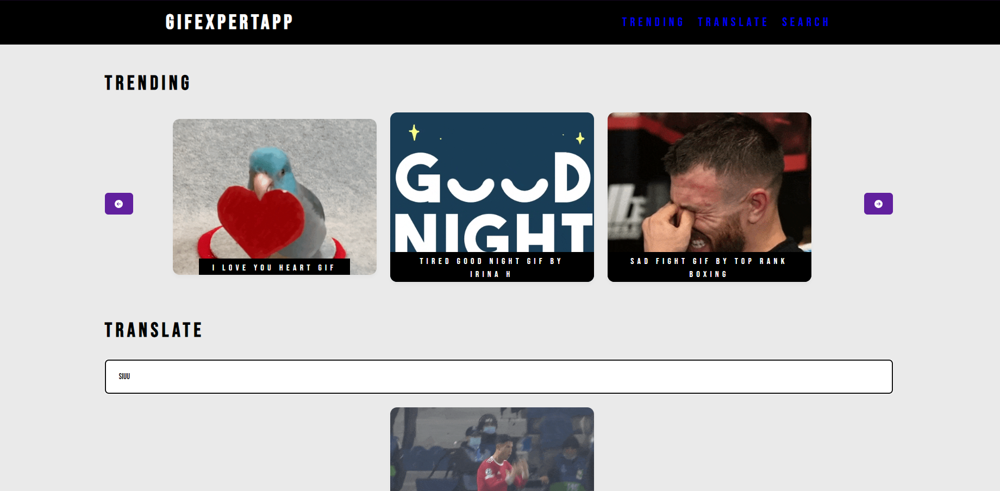
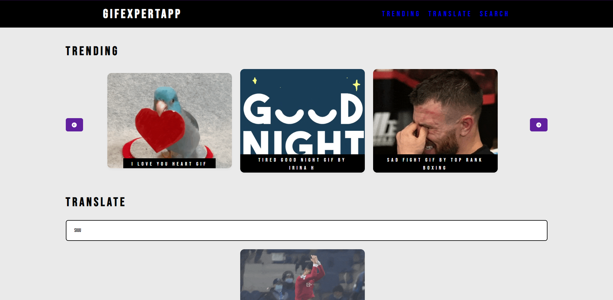
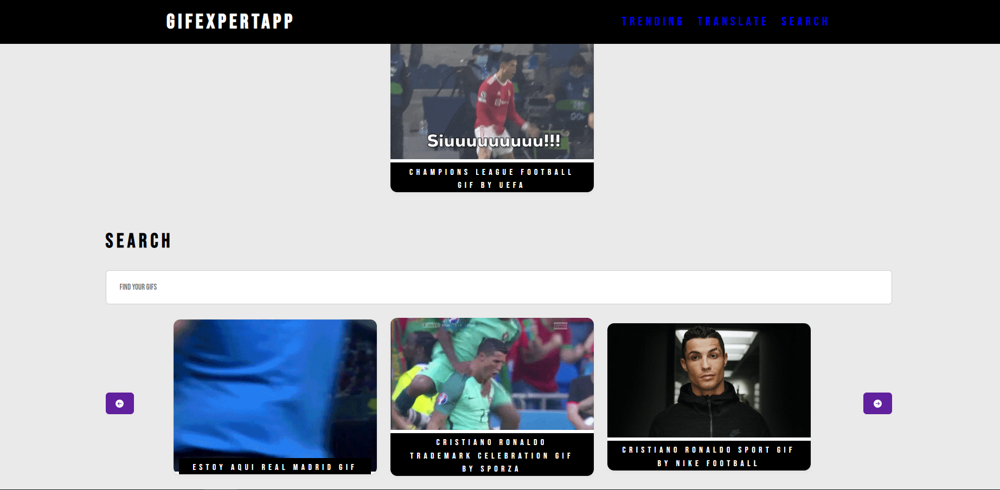
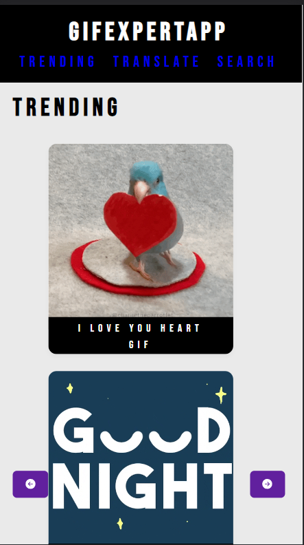

# GifExpertApp - Aplicación de búsqueda de GIFs



GifExpertApp es una aplicación web que te permite buscar y ver GIFs relacionados con palabras o frases específicas. La aplicación está desarrollada utilizando ReactJS y hace uso de la API de Giphy para obtener los GIFs.

## Características

- Búsqueda de GIFs: Ingresa una palabra o frase en el campo de búsqueda y obtén GIFs relacionados.
- Trending: Muestra los GIFs más populares y en tendencia actualmente.
- Translate: Convierte palabras o frases en GIFs divertidos.

## Capturas de pantalla







## Instalación

1. Clona este repositorio en tu máquina local:

```cmd
git clone https://github.com/fabio4520/GifExpertApp.git
```

2. Navega al directorio del proyecto:

```cmd
cd GifExpertApp
```

3. Instala las dependencias:

```cmd
yarn install
```

4. Inicia la aplicación:

```cmd
yarn dev
```

La aplicación se ejecutará en `http://localhost:3000` en tu navegador.

## Estructura del Proyecto

- `public`: Contiene el archivo HTML base y otros recursos estáticos.
- `src`: Contiene el código fuente de la aplicación.
  - `api`: Contiene las funciones para interactuar con la API de Giphy.
  - `componentes`: Contiene los componentes React utilizados en la aplicación.
  - `hooks`: Contiene los hooks personalizados utilizados para obtener datos.
  - `styles.css`: Archivo de estilos CSS para la aplicación.
  - `index.js`: Punto de entrada de la aplicación.
  - `App.js`: Componente principal que define la estructura general de la aplicación.

## Contribuciones

Las contribuciones son bienvenidas. Si deseas colaborar en este proyecto, sigue estos pasos:

1. Fork este repositorio.
2. Crea una rama con tu nueva función o corrección de errores: `git checkout -b nueva-funcion`.
3. Haz tus cambios y confirma los cambios: `git commit -m 'Agrega nueva función'`.
4. Envía tus cambios a tu repositorio: `git push origin nueva-funcion`.
5. Envía una solicitud de extracción a la rama principal de este repositorio.

## Autor

- [Fabio Fiestas](https://github.com/fabio4520)

Si tienes alguna pregunta o inquietud, no dudes en contactarme. ¡Gracias por usar GifExpertApp!
